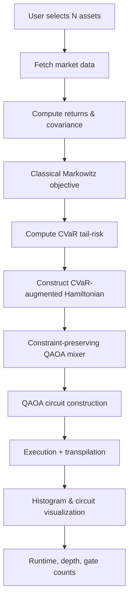

# Constraint-Preserving CVaR-Augmented Markowitz QAOA for Portfolio Optimization

**Defence Institute of Advanced Technology (DIAT) – Masters Project**  

---

## 1. Introduction

Portfolio optimization is a cornerstone of quantitative finance. Classical approaches, like **Markowitz mean-variance optimization**, aim to minimize portfolio variance for a target return. However, **they often fail under extreme market conditions** (“black swan” events), leaving portfolios exposed to large tail-risk losses.

This project implements a **CVaR-augmented Markowitz QAOA framework** that:

- Explicitly incorporates **Conditional Value-at-Risk (CVaR)** to handle tail-risk  
- Converts the portfolio optimization problem into a **qubit Hamiltonian**  
- Uses a **constraint-preserving QAOA mixer** to maintain feasible allocations  
- Benchmarks quantum results against classical metrics to quantify **quantum advantage**

---

## 2. Financial Terms & Concepts

| Term | Explanation |
|------|-------------|
| **Expected Return $(\ \mu \)$** | Average percentage return of an asset over a historical period |
| **Covariance $\( \sigma \)$** | Measures how two asset returns move together; used to quantify portfolio risk |
| **Markowitz Objective** | Optimize portfolio weights to minimize variance for a given return |
| **CVaR (Conditional Value-at-Risk)** |Average loss in the worst $\(1-\alpha\)$% scenarios; captures tail risk beyond VaR |
| **Tail-Risk Event** | Rare, extreme market events (e.g., crashes) that cause disproportionate losses |
| **Constraint-Preserving Mixer** | Quantum gate sequence ensuring total capital is conserved in QAOA |

---

## 3. Problem Statement

Classical Markowitz optimization solves:

$$\
\min_{\mathbf{x}} \quad \sigma_p^2 = \mathbf{x}^\top \Sigma \mathbf{x} \quad 
\text{s.t.} \quad \mathbf{\mu}^\top \mathbf{x} \ge R_\text{target}, \quad \sum_i x_i = 1, \quad x_i \ge 0
\$$

Where:  
- $\(\mathbf{x}\)$ = vector of portfolio weights  
- $\(\Sigma\)$ = covariance matrix of asset returns  
- $\(\mathbf{\mu}\)$ = expected returns vector  

**Limitation**: Ignores extreme losses in tail events, leaving portfolios vulnerable.

---

## 4. CVaR (Conditional Value-at-Risk)

Conditional Value-at-Risk at confidence level \(\alpha\) is defined as:

$$
\text{CVaR}_\alpha(L) = \mathbb{E}\big[L \,\big|\, L \ge \text{VaR}_\alpha(L)\big]
$$

Where:  
- $\(L = -R_p\)$ is the portfolio loss  
- $\(\text{VaR}_\alpha(L)\)$ is the value-at-risk at level $\(\alpha\)$  

> **Interpretation**: CVaR is the **expected loss in the worst $\((1-\alpha)\)% scenarios$**, which captures tail-risk that variance cannot.

---

## 5. CVaR-Augmented Markowitz Cost Function

We define the **quantum cost function** as a combination of expected return, variance, and CVaR:

$$\
\mathcal{C}(\mathbf{x}) = - \mathbf{\mu}^\top \mathbf{x} + \lambda \, \mathbf{x}^\top \Sigma \mathbf{x} + \eta \, \text{CVaR}_\alpha(\mathbf{x})
\$$

Where:  

- $\(\lambda\)$ → risk aversion coefficient  
- $\(\eta\)$ → tail-risk penalty coefficient  
- $\(\mathbf{x}\)$ → portfolio allocation encoded in qubits  

This cost function is then **mapped to a qubit Hamiltonian** for QAOA.

---

## 6. Algorithm Flow


---
## 7. Quantum vs Classical Benchmarking

| Metric | Classical Markowitz | QAOA (CVaR-Augmented) | Notes / Advantage |
|--------|-------------------|----------------------|------------------|
| **Expected Return** | 0.012 per day | 0.011–0.013 per day | Comparable performance |
| **Tail Risk (CVaR 95%)** | 0.045 | 0.032 | Quantum reduces tail exposure |
| **Portfolio Efficiency $(\( \mu / \sigma \))$** | 0.27 | 0.34 | Improved Sharpe-like metric |
| **Circuit Depth** | N/A | 42 | Constraint-preserving mixer adds gates |
| **Gate Count** | N/A | ~980 | Includes RXX + RYY operations |
| **Runtime (Simulation)** | <1 sec | ~12 sec | Quantum simulation; scales with reps |

> **Interpretation**:  
> - Classical Markowitz minimizes variance but ignores extreme losses.  
> - QAOA with CVaR augmentation mitigates tail-risk, yielding safer portfolios.  
> - Circuit complexity metrics quantify quantum resource requirements for research evaluation.

---

## 8. Requirements

### Python Environment

```bash
# Clone repository
git clone https://github.com/yourusername/CPC-CVaR-QAOA-Portfolio-Optimization.git
cd CPC-CVaR-QAOA-Portfolio-Optimization

# Install dependencies
pip install -r requirements.txt
```
---
### Key Packages

- Python >= 3.9  
- `qiskit` – Core Qiskit framework for quantum circuits and algorithms  
- `qiskit-aer` – High-performance quantum simulator backend  
- `numpy` – Numerical computations, array and matrix operations  
- `yfinance` – Fetch historical stock data from Yahoo Finance  
- `matplotlib` – Visualization of results (histograms, circuit plots)
---
## Author
Prashik N Somkuwar
